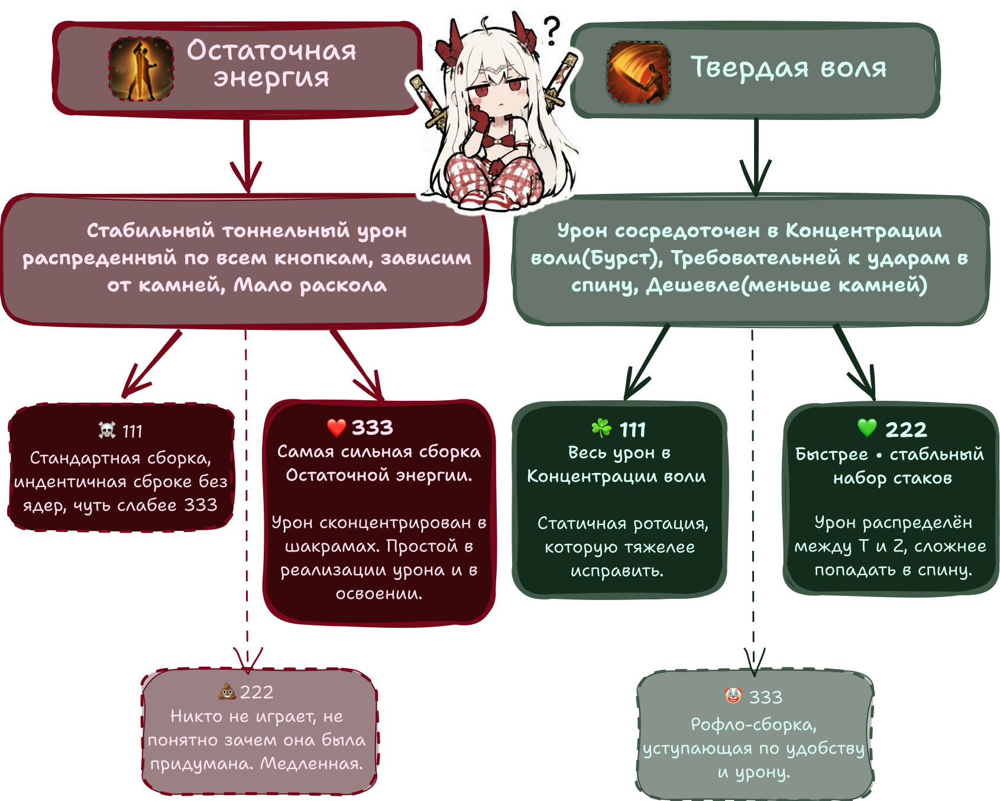

# Гайд по Клинку смерти | от Henstly

-   🌸 **Остаточная энергия**

    ---

    Набирай шарики, сбрасывай кд и наноси урон со всех кнопок.

    [Начать →](remaining-energy/essentials.md)

-   ⚡ **Твёрдая воля**

    ---

    Копи стаки и наноси один мощный удар.

    [Начать →](surge/essentials.md)

---

**Что за обозначения в названиях сборок?** Названия вроде 333, 111 и 222 — это сокращенное обозначение конфигурации ядер в созведиях для каждой сборки, а не показатель сложности. Цифры сокращаются в зависимости от положения ядра в игре в списке. Выберите сборку, чтобы узнать подробности.

## Дополнительные ресурсы

*(Подходят для обоих стилей игры;ссылки, калькуляторы и бонусный контент см. в разделе [Дополнительные ресурсы](resources.md).)*

---

**О сайте:** Данный сайт был адаптирован для RU региона с EU вы можете самостоятельно взять сайт и адаптировать его под свой класс или сделать гайд со своим видением клинка [репозиторий](https://github.com/interlockme/deathblade). Информация на сайте соответвует не на **100%** EU версии. Какая то ифнормация была описана орентируясь на моё видение и видение игроков на клинках RU региона. А так же часть информация взята с игкров региона KR.

**Если вы со мной не согласный или хотите задать вопрос** вы можете написать мне в Discord | @henstly. 